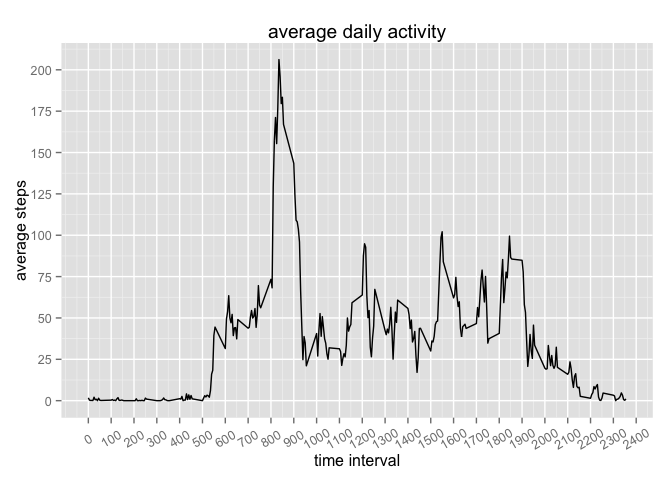
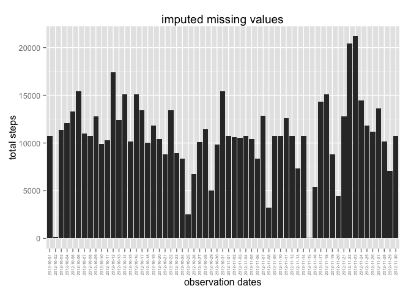

# Reproducible Research: Peer Assessment 1


## Loading and preprocessing the data

```r
unzip("activity.zip")
data <- read.csv("activity.csv")
```

## What is mean total number of steps taken per day?

```r
library(dplyr)
library(ggplot2)

df <- summarize(na.omit(data) %>% group_by(date), steps = sum(steps))
qplot(date, steps, data = df, stat = "identity", geom = "histogram") +
    geom_histogram(binwidth = 10) +
    theme(axis.text.x = element_text(angle = 90, hjust = 1, vjust = 0.5, size = 5)) +
    xlab("observation dates") +
    ylab("total steps") +
    labs(title = "missing values removed")
```

 

```r
avg <- mean(df$steps)
print(paste("the mean is ", avg))
```

```
## [1] "the mean is  10766.1886792453"
```

```r
med <- median(df$steps)
print(paste("the median is ", med))
```

```
## [1] "the median is  10765"
```

## What is the average daily activity pattern?

```r
library(dplyr)
library(ggplot2)
df_interval <- summarize(na.omit(data) %>% group_by(interval), steps = mean(steps))

qplot(interval, steps, data = df_interval, geom = "line") +
    scale_x_continuous(breaks = seq(0, 3000, by = 100)) +
    scale_y_continuous(breaks = seq(0, 250, by = 25)) +
    theme(axis.text.x = element_text(angle = 30, hjust = 0.5, vjust = 0.5)) +
    xlab("time interval") +
    ylab("total steps") +
    labs(title = "average daily activity")
```

 

```r
x <- df_interval[which.max(df_interval$steps),]
sprintf("The 5 minute interval %.0f has the max average number of steps %f", x$interval, x$avg.steps)
```

```
## character(0)
```

## Imputing missing values
### number of missing values

```r
sumNA <- sum(is.na(data$steps))
sprintf("Number of missing values %.0f", sumNA)
```

```
## [1] "Number of missing values 2304"
```
### use interval mean of primary data set to address NA values

```r
library(dplyr)
library(ggplot2)

# calculate mean per interval 
#df <- summarize(na.omit(data) %>% group_by(interval), avg.steps = mean(steps))
#df1 <- summarize(df %>% group_by(interval), steps = mean(avg.steps))

# NA rows 

data_NA <- filter(data, is.na(steps))
data_noNA <- filter(data, !is.na(steps))
data_NA$steps <- NULL

# add steps column
df2 <- inner_join(data_NA, df_interval)
```

```
## Joining by: "interval"
```

```r
# re-arrange columns
df2 <- df2[c(3, 1, 2)]
names(df)
```

```
## [1] "date"  "steps"
```

```r
names(df2)
```

```
## [1] "steps"    "date"     "interval"
```

```r
names(data_noNA)
```

```
## [1] "steps"    "date"     "interval"
```

```r
# row bind
df <- rbind(data_noNA, df2)
names(df)
```

```
## [1] "steps"    "date"     "interval"
```

```r
dim(df)
```

```
## [1] 17568     3
```

```r
df <- summarize(df %>% group_by(date), steps = sum(steps))

qplot(date, steps, data = df, stat = "identity", geom = "histogram") +
    geom_histogram(binwidth = 10) +
    theme(axis.text.x = element_text(angle = 90, hjust = 1, vjust = 0.5, size = 5)) +
    xlab("observation dates") +
    ylab("total steps") +
    labs(title = "imputed missing values")
```

 

```r
avg <- mean(df$steps)
print(paste("the mean with imputed missing values is ", avg))
```

```
## [1] "the mean with imputed missing values is  10766.1886792453"
```

```r
med <- median(df$steps)
print(paste("the median with imputed missing values is ", med))
```

```
## [1] "the median with imputed missing values is  10766.1886792453"
```

## Are there differences in activity patterns between weekdays and weekends?


