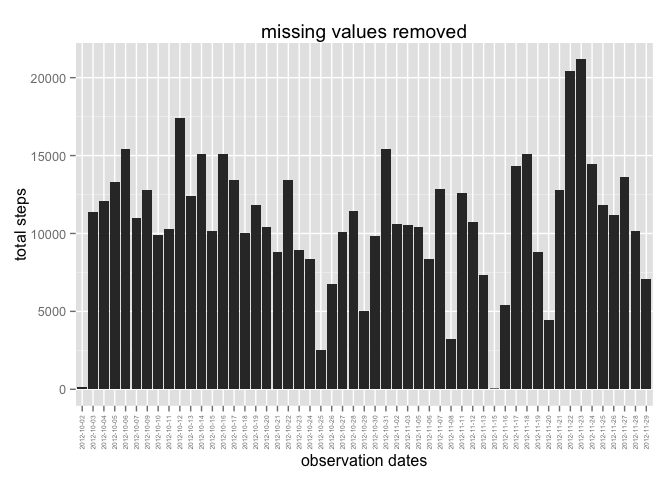

# Reproducible Research: Peer Assessment 1


### Loading and preprocessing the data

```r
unzip("activity.zip")
data <- read.csv("activity.csv")
```

### What is mean total number of steps taken per day?

```r
library(dplyr)
library(ggplot2)

df_date <- summarize(na.omit(data) %>% group_by(date), steps = sum(steps))

qplot(date, steps, data = df_date, stat = "identity", geom = "histogram") +
    geom_histogram(binwidth = 10) +
    theme(axis.text.x = element_text(angle = 90, hjust = 1, vjust = 0.5, size = 5)) +
    xlab("observation dates") +
    ylab("total steps") +
    labs(title = "missing values removed")
```

 

```r
avg <- mean(df_date$steps)
print(paste("the mean is ", avg))
```

```
## [1] "the mean is  10766.1886792453"
```

```r
med <- median(df_date$steps)
print(paste("the median is ", med))
```

```
## [1] "the median is  10765"
```

### What is the average daily activity pattern?

```r
library(dplyr)
library(ggplot2)
df_interval <- summarize(na.omit(data) %>% group_by(interval), steps = mean(steps))

qplot(interval, steps, data = df_interval, geom = "line") +
    scale_x_continuous(breaks = seq(0, 3000, by = 100)) +
    scale_y_continuous(breaks = seq(0, 250, by = 25)) +
    theme(axis.text.x = element_text(angle = 30, hjust = 0.5, vjust = 0.5)) +
    xlab("time interval") +
    ylab("average steps") +
    labs(title = "average daily activity")
```

 

```r
x <- df_interval[which.max(df_interval$steps),]
sprintf("The 5 minute interval %.0f has the max average number of steps %f", 
        x$interval, x$steps)
```

```
## [1] "The 5 minute interval 835 has the max average number of steps 206.169811"
```

### Imputing missing values
#### number of missing values

```r
sumNA <- sum(is.na(data$steps))
sprintf("Number of missing values %.0f", sumNA)
```

```
## [1] "Number of missing values 2304"
```
#### use interval mean of primary data set to address NA values
 

```
## [1] "the mean with imputed missing values is  10766.1886792453"
```

```
## [1] "the median with imputed missing values is  10766.1886792453"
```

### Are there differences in activity patterns between weekdays and weekends?

```r
# add day of week as factor
df$dayofweek <- as.factor(weekdays(as.Date(df$date)))
z <- ifelse(df$dayofweek %in% c("Saturday", "Sunday"), "Weekend", "Weekday")
df <- cbind(df, z)

# rollup weekday/weekend, interval
df_rollup <- summarize(df %>% group_by(z, interval), steps = mean(steps))

ggplot(df_rollup, aes(interval, steps)) + 
    geom_line() + 
    facet_wrap(~ z, ncol = 1) +
    xlab("5-minute interval") + 
    ylab("Number of steps")
```

 

